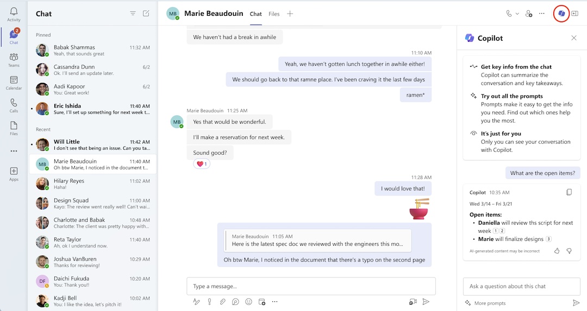

# تلخيص سلاسل المحادثات والقنوات باستخدام Microsoft 365 Copilot في Teams
---
إن امتلاك الكفاءة في برنامج Copilot لـ Teams يعد مهارة محورية للمديرين التنفيذيين الذين يسعون إلى تبسيط التعاون وتحقيق نتائج قابلة للتنفيذ في فرقهم. في عالم الاتصالات سريع الخطى، يعد البحث بين سلسلة رسائل المحادثات والقنوات لاستخلاص عناصر العمل الرئيسية مهمة تستغرق وقتًا طويلًا. يقوم تطبيق Copilot for Teams بإحداث ثورة في هذه العملية من خلال تحليل المحادثات بذكاء وإنشاء قائمة موجزة من عناصر العمل.

إن المديرين التنفيذيين أو القادة الذين يستغلون هذه القدرة لا يوفرون الوقت الثمين فحسب، بل يضمنون أيضًا تحديد المهام الحرجة ومعالجتها على الفور. لا تعمل هذه المهارة على تعزيز الإنتاجية داخل الفريق فحسب، بل إنها تعمل أيضًا على تعزيز القيادة الفعالة، مما يتيح لك البقاء على اطلاع بالأولويات وتعزيز ثقافة الكفاءة. يصبح Copilot لـ Teams، باعتباره مساعدًا تعاونيًا، أصلًا لا يقدر بثمن يسعى إلى قيادة الفرق نحو نتائج ملموسة.

### تمرين

عند استخدام Microsoft 365 Copilot في Teams لفحص تفاصيل محادثة أو قناة معينة، يمكن لـ Copilot توفير قائمة بالمطالبات المحددة مسبقًا والمستخدمة بشكل شائع للاختيار من بينها. يؤدي اختيار مطالبة من هذه القائمة إلى تجنب الحاجة إلى كتابتها يدويًا. كما أنه يوفر اقتراحات بشأن مطالبات أخرى يمكنك استخدامها عند العمل في الدردشة أو القناة.

في جزء **Copilot**، عند تحديد خيار **المزيد من المطالبات**، يعرض Copilot قائمة منسدلة تحتوي على المطالبات المحددة مسبقًا. هناك نوعان من المطالبات المحددة مسبقًا والمتاحة:

 -  المطالبات المرتبطة بالوقت، مثل:
     -  أبرز أحداث اليوم الماضي
     -  أبرز أحداث الأيام السبعة الماضية
     -  أبرز الأحداث خلال الثلاثين يومًا الماضية

 -  المطالبات غير المرتبطة بالوقت، مثل:
     -  ما هي القرارات التي تم اتخاذها؟
     -  ما هي العناصر المفتوحة؟
     -  أهم النقاط من هذه المحادثة (قناة Teams)
     -  خلاصة الاجتماع (دردشة Teams)

> **هام**: قد تختلف المطالبات المحددة مسبقًا التي يعرضها Copilot وفقًا للمحتوى المتوفر في الدردشة أو القناة المحددة.

يستخدم Microsoft 365 Copilot في Teams الإرشادات التالية لتحديد المطالبات التي سيتم عرضها لمحادثة أو قناة معينة:

 -  يتضمن Microsoft 365 Copilot مطالبة "تلخيص الاجتماع" لمدة 24 ساعة بعد توفر نص الاجتماع في الدردشة.
 -  يتضمن Copilot فقط المطالبات المرتبطة بالوقت ("أبرز ما حدث في الماضي...") والمطالبات غير المرتبطة بالوقت ("القرارات / العناصر المفتوحة") إذا كان هناك محتوى كافٍ في الإطار الزمني لضمان ذلك.
 -  لا يعرض Copilot أي مطالبات للدردشة إذا لم يكن هناك محتوى كافٍ في اليوم الماضي. في هذه الحالة، يعرض Copilot الرسالة التالية عند تحديد **المزيد من المطالبات**: *ستتمكن من استخدام المطالبات عند وجود محتوى جديد في الدردشة. وفي الوقت نفسه، لا يزال بإمكان Copilot الإجابة على أسئلتك.*

> **ملاحظة**: إذا لم يكن لدى الدردشة أو القناة محتوى كافٍ لتبرير استخدام Copilot، فلن تظهر أيقونة Copilot عند تحديد الدردشة أو القناة.

#### استخدام Microsoft 365 Copilot في دردشة Teams

بصفتك مديرًا تنفيذيًا أو قائدًا في مؤسستك، فأنت تريد استخدام Microsoft 365 Copilot في الدردشة والقنوات في Microsoft Teams لمساعدتك في التعرّف بسرعة على المحادثات. في هذا التمرين، تريد من Copilot تلخيص النقاط الرئيسية من الأيام الثلاثين الماضية لمحادثة محددة. ابدأ باستخدام أحد المطالبات المحددة مسبقًا في Copilot لجمع هذه المعلومات. من هناك، يمكنك كتابة سلسلة من المطالبات للتعمق في النتائج.

1.  حدد **الدردشة** من شريط التنقل على الجانب الأيسر من **Teams**، ثم حدد الدردشة التي تهمك بشكل خاص. بالنسبة لهذه المهمة الأولى، حدد محادثة تعلم أنها امتدت على مدار عدة أيام - ربما محادثة من اجتماع متكرر.

2.  حدد أيقونة **فتح Copilot** في الزاوية العلوية اليمنى من الدردشة.
    
   
    
    
   > **ملاحظة:** تظهر أيقونة Copilot في الدردشة الفردية والدردشة الجماعية ودردشة الاجتماع.

3.  في الجزء السفلي من جزء **Copilot** الذي يظهر، ضمن حقل المطالبة، حدد **مزيد من المطالبات**. في القائمة المنسدلة التي تظهر، حدد **أبرز الأحداث خلال الثلاثين يومًا الماضية**. إذا لم تظهر هذه المطالبة المحددة مسبقًا في القائمة المنسدلة، فأدخل المطالبة التالية بدلًا من ذلك:
    
    **تلخيص هذه الدردشة**.

4.  في رد Copilot، لاحظ كيف يتضمن Microsoft 365 Copilot رقمًا موضحًا بملحوظة سفلية في نهاية كل بيان. توفر كل ملحوظة سفلية رابطًا مباشرًا للبيان المميز. حدّد إحدى الحواشي السفلية لعنصر مميز. عند القيام بذلك، لاحظ كيف يقوم Copilot بالتمرير مباشرة إلى تلك الرسالة في سلسلة رسائل الدردشة. تتيح لك هذه الميزة التنقل بسرعة إلى عنصر مميّز دون الحاجة إلى التمرير يدويًا عبر سلسلة رسائل المحادثات للعثور عليه. كرر هذه الخطوة لبعض العناصر المميّزة لمعرفة مدى قيمة هذه الميزة.

5.  قد تجد نفسك في كثير من الأحيان مهتمًا بما قاله شخص معين في سلسلة رسائل الدردشة. أدخل المطالبة التالية (استبدل "name of the person" باسم الشخص) وحدد الأيقونة **إرسال** :
    
    **ماذا قال \{اسم الشخص\}؟**

6.  بمجرد أن ينشئ Copilot استجابة، حدد الحاشية السفلية لعنصر معين للتمرير مباشرة إلى تلك الرسالة. لاحظ كيف تسمح لك هذه الميزة بالتركيز بسرعة على استجابة معينة من هذا الشخص.

7.  في جزء **الدردشة**، حدد الدردشة لاجتماع آخر تشعر أنه يحتوي على رسائل مهمة. لاحظ كيف يختفي جزء **Copilot**. يظهر جزء Copilot فقط للدردشة عند تحديد أيقونة Copilot في الزاوية العلوية اليمنى من نافذة الدردشة. حدد أيقونة **Copilot** لهذه الدردشة.

8.  في الجزء السفلي من جزء **Copilot** الذي يظهر، ضمن حقل المطالبة، حدد **مزيد من المطالبات**. في القائمة المنسدلة التي تظهر، حدد **ما هي القرارات التي تم اتخاذها** ؟ إذا لم تظهر هذه المطالبة، أدخل هذه المطالبة يدويًا وحدد الأيقونة **إرسال**.

9.  مراجعة القرارات التي تم اتخاذها. حدد حاشية سفلية لعنصر معين للتمرير مباشرة إلى هذا القرار.

10. حدد **المزيد من المطالبات**. في القائمة المنسدلة التي تظهر، حدد **ما هي العناصر** المفتوحة؟ إذا لم تظهر هذه المطالبة، أدخل هذه المطالبة يدويًا وحدد الأيقونة **إرسال**.

11. مراجعة القرارات التي تم اتخاذها. حدد حاشية سفلية لعنصر معين للتمرير مباشرة إلى هذا العنصر المفتوح.

12. تريد الآن استخدام Microsoft 365 Copilot في دردشة Microsoft Teams لمساعدتك على البدء بسرعة في محادثة معينة. للقيام بذلك، تخطط لاستخدام إحدى المطالبات المحددة مسبقًا من Copilot لتوفير ملخص للاجتماع. مع وجود هذه المعلومات في متناول يدك، فأنت تخطط لكتابة سلسلة من المطالبات للتعمق في النتائج. للبدء، حدد موقع سلسلة رسائل دردشة معينة تهمك، ثم حدد الدردشة لفتحها.

13. مع فتح سلسلة رسائل الدردشة، حدد أيقونة **افتح Copilot** في الزاوية العلوية اليمنى من الدردشة.

14. في الجزء السفلي من جزء **Copilot** الذي يظهر، ضمن حقل المطالبة، حدد **مزيد من المطالبات**. في القائمة المنسدلة التي تظهر، حدد **خلاصة الاجتماع**. إذا لم تظهر هذه المطالبة المعرفة مسبقًا في القائمة المنسدلة، فأدخل هذه المطالبة يدويًا ثم حدد الأيقونة **إرسال**.

15. إذا كنت تتذكر من تدريب الدردشة السابق في Teams، فإن **أهم المميزات من المطالبات السابقة** قدمت أرقامًا بعلامة سفلية في نهاية كل عبارة. سمحت لك هذه الحواشي السفلية بالتمرير مباشرة إلى كل عبارة مميزة في الدردشة. ومع ذلك، في هذه الدردشة، لاحظ كيف أن مطالبة **خلاصة الاجتماع** لا توفر استجابات ذات أرقام سفلية. هذا هو أحد الاختلافات الرئيسية بين مطالبة محددة مسبقًا لها حد زمني ومطالبة محددة مسبقًا بدون حد زمني.

16. في الخطوة السابقة، قمت بتحديد مطالبة **خلاصة الاجتماع** المحددة مسبقًا. للحصول على شعور أفضل حول كيفية توفير أنواع مختلفة من المطالبات لنتائج مختلفة، أدخل المطالبة التالية، والتي تكون مرادفة إلى حد ما لمطالبة **خلاصة الاجتماع**، ثم حدد أيقونة **إرسال**:
    
    **تلخيص الاجتماع**

17. قارن النتائج التي تلقيتها من مطالبة **خلاصة الاجتماع** المحددة مسبقًا مع النتائج من مطالبة **تلخيص الاجتماع** غير المحددة مسبقًا. لاحظ الاختلافات التي تم إنشاؤها في كل استجابة.

18. في الدردشة السابقة التي عملت عليها، حددت المطالبات المحددة مسبقًا التي سألت Microsoft 365 Copilot في Teams **"ما هي القرارات التي تم اتخاذها؟"** و **"ما هي العناصر المفتوحة؟"** بدلًا من إرسال نفس هذه المطالبات المعرفة مسبقًا مرة أخرى، دعنا نجرب شيئًا مختلفًا. هذه المرة، أدخل المطالبة التالية وحدد أيقونة **إرسال**:
    
**هل بدا أي شخص منزعجًا من الاجتماع؟**
19. لاحظ استجابة Copilot. ضع هذه الاستجابة في الاعتبار أثناء كتابة المطالبات في المستقبل. كأداة ذكاء اصطناعي، هناك قيود معينة على قدرات Copilot.

#### استخدام Microsoft 365 Copilot في قناة Teams

يعمل Microsoft 365 Copilot في قناة Teams بشكل مشابه لـ Microsoft 365 Copilot في دردشة Teams.

1.  حدد **Teams** من شريط التنقل على الجانب الأيمن من **Teams**، ثم حدد قناة معينة داخل Teams.

2.  ضمن مناقشة القناة، حدد الرابط الموجود أسفل منشور القناة لتوسيع الردود ورؤية المحادثة الكاملة.
    
    
    
3.  من طريقة عرض منشور القناة الغامر هذه، حدد الأيقونة **افتح Copilot القناة** في الزاوية العلوية اليمنى من عرض القناة.
    
    
    
4.  في الجزء السفلي من جزء **Copilot** الذي يظهر، ضمن حقل المطالبة، حدد **مزيد من المطالبات**. في القائمة المنسدلة التي تظهر، حدد **أبرز ما جاء في هذه المحادثة**. إذا لم تظهر هذه المطالبة، أدخل هذه المطالبة يدويًا، ثم حدد أيقونة **إرسال**.

5.  كرر هذه العملية عن طريق تحديد أي من المطالبات الأخرى المحددة مسبقًا والتي تظهر أو أدخل مطالباتك الخاصة. لاحظ كيف تظهر الحواشي السفلية في ردود Copilot، تمامًا كما فعلت في الدردشات التي حددتها سابقًا.
