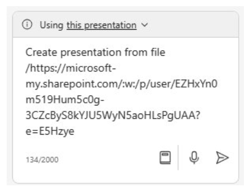

# إنشاء عرض تقديمي باستخدام Microsoft 365 Copilot في PowerPoint
---
الكفاءة في استخدام Copilot لـ PowerPoint هي مهارة استراتيجية للمديرين التنفيذيين والقادة الذين يهدفون إلى زيادة تأثير عروضهم التقديمية. بصفتك قائدًا، فإن التواصل الفعّال من خلال العروض التقديمية المقنعة أمر بالغ الأهمية. يعمل Copilot لـ PowerPoint كمتعاون ذكي، يقدم اقتراحات وتحسينات في الوقت الحقيقي أثناء إعداد عروضك التقديمية. لا تعمل هذه الأداة على تسريع عملية الإنشاء فحسب، بل تضمن أيضًا أن يكون المحتوى جذابًا وواضحًا ومتوافقًا مع الجمهور المستهدف.

يمنحك كونك كفء في استخدام Copilot لـ PowerPoint ميزة تنافسية من خلال تحسين تراسلك دون عناء، وتعزيز الجاذبية البصرية، والحفاظ على مستوى مهني. لا توفر هذه المهارة الوقت فحسب، بل إنها أيضًا تحفزك على تقديم عروض تقديمية تترك انطباعًا دائمًا، وتعزز التواصل الفعّال، وتعزز تأثير القيادة.

باستخدام Microsoft 365 Copilot في PowerPoint، يمكنك إنشاء عرض تقديمي من مستند Word موجود. عندما تقدم لـ Microsoft 365 Copilot في PowerPoint رابطًا لمستند Word الخاص بك، فإنه يمكنه إنشاء الشرائح وتطبيق التخطيطات واختيار السمة لك.

### تمرين

بصفتك رئيس قسم التكنولوجيا في مؤسستك، ستجتمع الأسبوع المقبل مع القادة الآخرين في مؤسستك لتقديم عرض تقديمي حول حالة جهود التحول الرقمي داخل مؤسستك. قدم لك مساعدك ملخصًا للتقدم والتأثير الذي حققه المشروع حتى الآن.

في التدريب السابق، استخدمت Microsoft 365 Copilot في Word لكتابة خطابك استنادًا إلى المعلومات الواردة في تقرير التقدم. في هذا التدريب، تخطط لاستخدام Microsoft 365 Copilot في PowerPoint لإنشاء عرض تقديمي بشرائح عرض استنادًا إلى خطابك. للقيام بذلك، يجب أن تبدأ بنسخ الرابط إلى ملف **Digital Transformation Speech.docx** الذي قمت بإنشائه في التدريب السابق.

في التدريب السابق، قمت بالوصول إلى الملخص في Copilot عن طريق الوصول إلى الملف من قائمة الملفات المستخدمة مؤخرًا (MRU). في هذا التدريب، ستكتسب خبرة في الوصول إلى أحد الملفات باستخدام عملية مختلفة. بدلًا من استخدام قائمة MRU، فأنت تخطط للوصول إلى الخطاب عن طريق نسخ مسار الملف الخاص به إلى Copilot من خلال الخيار مشاركة في **Word**. نفذ الخطوات التالية لجعل Microsoft 365 Copilot في PowerPoint ينشئ مسودة للعرض التقديمي:

1.  إذا كانت لديك علامة تبويب Microsoft 365 مفتوحة في متصفح Edge، فحددها الآن؛ وإلا، افتح علامة تبويب جديدة وأدخل عنوان URL التالي: **https://www.office.com**.

2.  في جزء تنقل **Microsoft 365**، حدد **Word** لفتح صفحة ملف Word.

3.  في صفحة الملف في **Word**، قم بالتمرير لأسفل وصولًا إلى قائمة الملفات الأخيرة وحدد **Digital Transformation Speech.docx** لفتحه في علامة تبويب جديدة في متصفح Microsoft Edge.

4.  انسخ عنوان URL للمستند عن طريق تحديد زر **مشاركة** في الزاوية العلوية اليمنى، أعلى الشريط وتحديد **نسخ الرابط** من القائمة المنسدلة التي تظهر.
    
    
    
    
     > **تلميح:** قد يواجه Copilot أحيانًا مشكلة في استخدام عنوان URL من شريط العناوين. انسخ الرابط من مجموعة **المشاركة** للحصول على أفضل النتائج.

5.  أغلق مربع الحوار **الرابط المنسوخ** الذي يظهر في Word.

6.  أغلق علامة تبويب المستند هذه في متصفح Microsoft Edge. يؤدي ذلك إلى إرجاعك إلى علامة تبويب **Word \| Microsoft 365**.

7.  في صفحة ملف Word، حدد أيقونة **PowerPoint** في جزء التنقل على اليسار.

8.  في **PowerPoint**، افتح عرض تقديمي فارغ جديد.

9.  حدد خيار **Copilot** على الجانب الأيمن من الشريط.

10. في جزء **Copilot** الذي يظهر، تتوفر العديد من المطالبات المعرفة مسبقًا للاختيار من بينها. حدد المطالبة **إنشاء عرض تقديمي من ملف**.

11. في التدريب السابق، قمت بربط ملف في مطالبة عن طريق تحديد الملف من قائمة MRU. في هذا التدريب، نريدك أن تكتسب خبرة في ربط ملف بمطالبة باستخدام طريقة أخرى. فوق حقل المطالبة في أسفل جزء **Copilot**، تظهر نافذة **الاقتراحات** التي تحتوي على الملفات الثلاثة الأحدث استخدامًا. عادةً، يمكنك تحديد الملف المطلوب إذا ظهر في هذه النافذة. ومع ذلك، في هذا التدريب، حتى إذا ظهر **Digital Transformation Speech.docxx** في قائمة MRU، فلنفترض أنه لم يظهر. على هذا النحو، يجب لصق الرابط إلى الملف في حقل المطالبة.
    
    في حقل المطالبة، يكتب Copilot تلقائيًا **إنشاء عرض تقديمي من ملف /**. ضع المؤشر بعد الشرطة المائلة للأمام واضغط على أزرار **Ctrl+V** للصق الرابط إلى هذا المستند في المطالبة.
    
    
    
12. حدد أيقونة **إرسال**.

13. تؤدي هذه المطالبة إلى تشغيل Copilot لإنشاء عرض تقديمي من شرائح عرض استنادًا إلى المستند. وعند القيام بذلك، يعرض المخطط التفصيلي للعرض التقديمي وقائمة بالميزات المضمنة في العرض التقديمي. قد تتضمن هذه الميزات ملاحظات المحاضر والصور والتخطيطات لتنظيم شرائح العرض ووصف الحساسية العامة.

14. يمكنك الآن مراجعة الشرائح وإجراء أي تحديثات ضرورية. بإمكانك استخدام أداة **المصمم** لضبط التخطيطات.

15. أثناء مراجعة شرائح العرض، ابحث عن إشارة إلى "المتحدث" أو أي عناصر أخرى قد تحتاج إلى تغييرها. على سبيل المثال، في مجموعة الاختبارات لهذا التمرين، أنشأ PowerPoint شريحة المقدمة تضمنت النص التالي:
    
    **يقدم المتحدث عرضًا تقديميًا حول التحويل إلى التقنيات الرقمية. وسيلخص العرض النتائج الرئيسية ويشرح كيفية توافقها مع الرؤية الاستراتيجية للشركة وأهدافها**.
    
    لاحظ الإشارة إلى "المتحدث" مع الجملة الثانية التي تبدأ بـ "سيتم تلخيص العرض التقديمي ...". هذه الأمثلة هي مثيلات للنص الذي يجب عليك البحث عنه في العروض التقديمية التي تم إنشاؤها بواسطة Copilot. ينبغي عليك إزالة هذه الأنواع من المراجع لأنها أكثر ملاءمة كملاحظات المتحدث وليس النص المخصص للجمهور.

16. راجع ملاحظات المتحدث التي أضافها Copilot إلى العرض التقديمي. تحقق من أنها توضح النقاط التي تريد إدخالها أثناء العرض التقديمي.

17. حاول استخدام Copilot لتحديث العرض التقديمي. على سبيل المثال، أدخل المطالبة التالية:
    
    **أضف شريحة جديدة بعد الشريحة 1. يجب أن تحتوي هذه الشريحة على صورة لقمة جبل في جبال الألب. وفي أسفل الشريحة، أضف مربع نص يقول: شعار شركة Fabrikam - "نتغلب على كل العقبات". أضف ملاحظات المتحدث إلى هذه الشريحة الجديدة التي تتحدث عن كيفية عمل Fabrikam بجدية لحل كل طلب من طلبات العملاء، وعدم السماح لأي عقبة بالوقوف في طريق نجاحها**.

18. راجع الشريحة الجديدة التي تم إنشاؤها. ما مدى نجاح Microsoft 365 Copilot في إنشاء هذه الشريحة؟

19. رغم أن تمارين التدريب المتبقية في هذه الوحدة لا تستخدم هذا العرض التقديمي، إلا أنه يمكنك إما تجاهله أو حفظه إذا كنت تريد الرجوع إليه في المستقبل.
