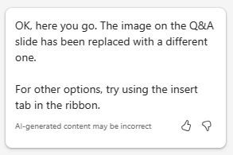

# إنشاء عرض تقديمي لخطة المشروع باستخدام Microsoft 365 Copilot في PowerPoint
---
إن إتقان استخدام Copilot لـ PowerPoint يُعد مهارة إستراتيجية لمحترفي تكنولوجيا المعلومات الذين يهدفون إلى رفع تأثير عروضهم التقديمية. في عالم الشركات، يُعد التواصل الفعّال من خلال عروض الشرائح الجذابة أمرًا بالغ الأهمية. يعمل Copilot لـ PowerPoint كمتعاون ذكي، حيث يقدم اقتراحات وتحسينات في الوقت الفعلي بينما يقوم متخصصو تكنولوجيا المعلومات بصياغة عروضهم التقديمية. لا تعمل هذه الأداة على تسريع عملية الإنشاء فحسب، بل تضمن أيضًا أن يكون المحتوى جذابًا وواضحًا ومتوافقًا مع الجمهور المستهدف.

قد يحتاج محترفو تكنولوجيا المعلومات إلى إنشاء عروض تقديمية باستخدام PowerPoint لأسباب مختلفة. على سبيل المثال، قد يحتاجون إلى:

 -  تقديم أفكارهم أو مقترحاتهم إلى فريقهم أو إدارتهم.
 -  تدريب الموظفين الجدد أو عرض البرامج أو الأجهزة الجديدة للعملاء.
 -  شرح المفاهيم التقنية المعقدة للجمهور غير الفني، مثل أصحاب المصلحة أو المستثمرين.
 -  عرض أعمالهم أو الترويج لخدماتهم للعملاء المحتملين.

باستخدام Microsoft 365 Copilot في PowerPoint، يمكنك إنشاء عرض تقديمي من مستند Word موجود. عندما تقدم لـ Microsoft 365 Copilot في PowerPoint رابطًا لمستند Word الخاص بك، فإنه يمكنه إنشاء الشرائح وتطبيق التخطيطات واختيار السمة لك.

في التمرين السابق، قمت بإنشاء خطة مشروع لتثبيت منتج أمان الشبكة. ثم طلبت من Copilot تحليل تقرير مواصفات المنتج لمنتج أمان الشبكة وتحديث خطة المشروع بالمعلومات الواردة في تقرير مواصفات المنتج.

في هذا التمرين، يمكنك استخدام Microsoft 365 Copilot في PowerPoint لإنشاء عرض تقديمي يعتمد على خطة المشروع. تريد استخدام هذا العرض التقديمي لشرح خطة المشروع لموظفي تكنولوجيا المعلومات لديك، وفي النهاية لإدارة الشركة.

### تمرين

بصفتك مديرًا لتكنولوجيا المعلومات في شركة Adatum Corporation، فأنت تخطط لتثبيت منتج أمان الشبكة Contoso CipherGuard Sentinel X7 في شبكة شركة Adatum. في التمرين السابق، استخدمت دردشة الأعمال لإنشاء خطة مشروع التثبيت. تريد الآن استخدام Microsoft 365 Copilot في PowerPoint لإنشاء عرض تقديمي استنادًا إلى هذه الخطة. يجب عليك تقديم خطة المشروع إلى موظفي تكنولوجيا المعلومات لديك، ثم إلى الإدارة التنفيذية للشركة. نفّذ الخطوات التالية لإنشاء مجموعة الشرائح التي تخطط لاستخدامها في عرضك التقديمي.

1.  إذا أكملت التمرين السابق وقمت بإنشاء ملف **Contoso CipherGuard project plan.docx**، فتأكد من نسخه إلى حسابك على OneDrive وانتقل إلى الخطوة التالية. ومع ذلك، إذا لم تتمكن من إنشاء خطة المشروع هذه في التمرين السابق، فحدد الرابط التالي لتنزيل [خطة مشروع Contoso CipherGuard](https://go.microsoft.com/fwlink/?linkid=2268924) التي تم إنشاؤها لك. بمجرد انتهاء تنزيل الملف، انسخه إلى حسابك على OneDrive.
2.  في هذه المرحلة، يجب أن يكون لديك ملف **Contoso CipherGuard project plan.docx** مخزّنًا في حسابك على OneDrive. افتح الملف للتأكد من أن كل شيء على ما يرام، ثم أغلق الملف. يضمن القيام بذلك أيضًا ظهوره في قائمة الملفات الأكثر استخدامًا مؤخرًا (MRU).
3.  إذا كان لديك علامة تبويب Microsoft 365 مفتوحة في متصفح Microsoft Edge، فحددها الآن؛ وإلا، فافتح علامة تبويب جديدة وأدخل عنوان URL التالي: **https://www.office.com**
4.  في الصفحة الرئيسية لـ **Microsoft 365**، حدد أيقونة **PowerPoint** في جزء التنقل الموجود على اليسار.
5.  في **PowerPoint**، افتح عرض تقديمي فارغ جديد.
6.  حدد خيار **Copilot** على الجانب الأيمن من الشريط.
7.  في جزء **Copilot** الذي يظهر، تتوفر العديد من المطالبات المعرفة مسبقًا للاختيار من بينها. حدد المطالبة **إنشاء عرض تقديمي من ملف**.
8.  في حقل المطالبة الموجود أسفل جزء **Copilot**، يدخل Copilot النص تلقائيًا: **إنشاء عرض تقديمي من الملف /**.الشرطة المائلة للأمام هي مؤشر Microsoft 365 Copilot العالمي لإدخال رابط إلى ملف. في هذه الحالة، يتم تشغيل Copilot لفتح نافذة **الاقتراحات** التي تعرض ثلاثة من الملفات الأكثر استخدامًا مؤخرًا.
     -  إذا ظهر ملفك هنا، فحدده الآن وانتقل إلى الخطوة التالية.
     -  إذا لم يكن الملف أحد الملفات الثلاثة المعروضة، فحدد السهم الأيمن (**&gt;**) في الزاوية اليمنى العليا من نافذة **الاقتراحات** لرؤية قائمة الملفات الأكثر استخدامًا مؤخرًا (MRU).الموسعة. إذا ظهر الملف هنا، فحدده الآن وانتقل إلى الخطوة التالية.
     -  إذا لم تتمكن من رؤية ملفك في قائمة الملفات الأكثر استخدامًا مؤخرًا (MRU).الموسعة، فيجب عليك نسخ الرابط إلى التقرير ولصقه في حقل المطالبة. للقيام بذلك:
        1.  حدد علامة التبويب متصفح **Microsoft 365** وحدد **Word** في جزء التنقل.
        2.  في الصفحة الرئيسية لـ **Word**، في قائمة الملفات الأخيرة، حدد التقرير لفتحه في Word.
        3.  في التقرير الموجود في Word، في أقصى اليمين أعلى الشريط، حدد زر **مشاركة**. في القائمة المنسدلة التي تظهر، حدد **نسخ الرابط**. انتظر حتى تظهر نافذة **تم نسخ الرابط**، وهو ما يضمن لك نسخ الرابط إلى الملف إلى الحافظة الخاصة بك.
        4.  انتقل إلى علامة التبويب **PowerPoint**، وفي أسفل جزء **Copilot**، يجب أن يظل حقل المطالبة يعرض **إنشاء عرض تقديمي من الملف /**. ضع المؤشر بعد الشرطة المائلة للأمام (**/**) ثم الصق الرابط إلى التقرير (**Ctrl+V**).
9.  لاحظ كيفية ظهور الملف في حقل المطالبة. حدد الأيقونة **إرسال** في حقل المطالبة.
10. أدت هذه المطالبة إلى تشغيل Copilot لإنشاء عرض تقديمي من شرائح عرض استنادًا إلى المستند. وعند القيام بذلك، عرض أولًا المخطط التفصيلي للعرض التقديمي. ثم يعرض نافذة منفصلة تعرض قائمة ذات تعداد نقطي ببعض التغييرات التي تم إجراؤها على العرض التقديمي استنادًا إلى المستند.
11. يمكنك الآن مراجعة الشرائح وإجراء أي تحديثات ضرورية. انتبه بشكل خاص إلى التغييرات التي أجراها Copilot بناءً على المستند. بإمكانك استخدام أداة **المصمم** لضبط التخطيطات.
12. راجع ملاحظات المتحدث التي أضافها Copilot إلى العرض التقديمي. تحقق من أنها توضح النقاط التي تريد إدخالها أثناء العرض التقديمي.
13. لاحظت أنه لا توجد شريحة في النهاية لجلسة الأسئلة والأجوبة (Q&A). لتصحيح هذا الخطأ، أدخل المطالبة التالية:
    
    **أضف شريحة أسئلة وأجوبة في نهاية العرض التقديمي مع صورة مناسبة**.
14. راجع الشريحة الجديدة التي تم إنشاؤها. لا تعجبك الصورة التي استخدمها Copilot لهذه الشريحة، لذا أدخل المطالبة التالية مطالبًا Copilot بتغيير الصورة:
    
    **لا تعجبني الصورة التي استخدمتها في شريحة الأسئلة والأجوبة. يُرجى استبدالها بصورة أخرى**.
15. ما هو الرد الذي تلقيته؟ في اختبارنا لهذا التمرين، في بعض الأحيان لم يستبدل برنامج Copilot الصورة وأعاد الرسالة التالية.
    
       
         
      في أوقات أخرى أثناء الاختبار، نجحت هذه المطالبة وقام Copilot باستبدال الصورة الموجودة على الشريحة وإظهار الرسالة التالية.
         
      

 > **تلميح:** تذكر أن Copilot لا يزال قيد التطوير، لذا لا تزال بعض الميزات قيد التطوير. كأفضل ممارسة، إذا لم يتمكن Copilot من إكمال طلبك، فحاول مرة أخرى. وإذا لم ينجح الأمر، فحاول إعادة صياغة طلبك أو تقسيمه إلى قسمين.

16. حتى لو نجح برنامج Copilot واستبدل صورتك، فلنفترض من أجل تمرين التدريب هذا أنه لم ينجح. في هذه الحالة، دعنا نطلب من Copilot ليس فقط استبدال الصورة، ولكن إزالة الشريحة القديمة واستبدالها بشريحة جديدة تمامًا تحتوي على صورة مختلفة. لذلك، أدخل المطالبة التالية:
    
    **يرجى إزالة شريحة الأسئلة والأجوبة وإضافة شريحة جديدة تحتوي على صورة مختلفة**.
17. ما هو الرد الذي تلقيته؟ في اختبارنا لهذا التمرين، قام Copilot بإزالة شريحة الأسئلة والأجوبة بشكل مستمر، لكنه لم ينشئ شريحة جديدة في مكانها. وبدلًا من ذلك، استمر في إرجاع الرسالة التالية.
    
      
    
    
      كيف استجاب Copilot عندما جربت هذه المطالبة؟
      
      -  هل أزال Copilot الشريحة القديمة وأنشئ شريحة جديدة بصورة مختلفة، تمامًا كما طلبت؟ إذا كان الأمر كذلك، فتهانينا!
      -  أم أنه أزال الشريحة القديمة ولكن لم ينشئ شريحة جديدة؟ إذا كان الأمر كذلك، فاطلب منه إنشاء شريحة أسئلة وأجوبة جديدة تحتوي على صورة.
      -  أم أنه لم يفعل شيئا على الإطلاق؟ إذا كان الأمر كذلك، فحاول تقسيم هذه المطالبة السابقة النهائية إلى قسمين - اطلب أولًا إزالة شريحة الأسئلة والأجوبة، ثم أرسل مطالبة ثانية تطلب منها إنشاء شريحة أسئلة وأجوبة جديدة تحتوي على صورة.
    
 > **تلميح:** إذا لم يفعل Copilot ما طلبته أو إذا أعاد خطأً، فإن هذا السيناريو يعد مثالًا جيدًا لإبقاء المطالبات بسيطة قدر الإمكان. اتبع اقتراح Copilot عن طريق إعادة صياغة طلبك. من الأفضل أن تطلب من Copilot القيام بمهمة واحدة في كل مرة، مثل إزالة الشريحة القديمة أولًا، ثم إرسال طلب ثانٍ لإضافة شريحة جديدة مع صورة (في اختبارنا، استخدم Copilot دائمًا صورة مختلفة مع كل طلب).
18. بغض النظر عن كيفية سير الخطوات القليلة الأخيرة في التعامل مع شريحة الأسئلة والأجوبة، فقد قررت المضي قدمًا ومحاولة القيام بشيء أخير. عند مراجعة العرض التقديمي، تقرر أنك تريد تغيير موضوع العرض التقديمي إلى شيء أكثر ملاءمة بسبب الطبيعة الفنية للموضوع. أدخل المطالبة التالية:
    
 **تغيير موضوع هذا العرض التقديمي إلى شيء أكثر تقنية.**
19. لاحظ استجابة Copilot.
    
   
    
    
يُعد هذا السيناريو أحد تلك الأوقات التي يكون من المهم فيها تذكر أفضل ممارسات المطالبة: **فهم قيود Copilot**. في هذه الحالة، لا يتعلق الأمر بفهم القيود بقدر ما يتعلق بفهم كيفية عمل Copilot. في هذه الحالة، يوجهك Copilot إلى ميزة PowerPoint الموجودة بدلًا من تكرار ما تفعله هذه الميزة.

20. رغم أن تمارين التدريب المتبقية في هذه الوحدة لا تستخدم هذا العرض التقديمي، إلا أنه يمكنك إما تجاهله أو حفظه إذا كنت تريده للرجوع إليه في المستقبل.
