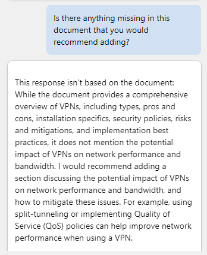

تحديث تقرير فني باستخدام Microsoft 365 Copilot في Word
---
Microsoft 365 Copilot في Word هو مساعد كتابة قائم على تكنولوجيا الذكاء الصناعي يمكن أن يساعد محترفي تكنولوجيا المعلومات في إنشاء المستندات بكفاءة أكبر. عند إنشاء مستند جديد أو العمل على مستند موجود، يمكن أن يساعدك Copilot بعدة طرق مختلفة.

 -  في مستند جديد وفارغ أو عندما تريد إضافة محتوى إلى مستند موجود، يمكنك إخبار Copilot بما تريد الكتابة عنه، وينشئ المحتوى وفقًا لذلك. على سبيل المثال، يمكنك إخبار Copilot "كتابة مقالة حول فوائد حوسبة السحابة" أو "إنشاء فقرة حول أهمية الأمان عبر الإنترنت". إذا كنت ترغب في ذلك، يمكنك تضمين ما يصل إلى ثلاثة ملفات موجودة كمدخلات أساسية للمحتوى الذي يقوم Copilot بإنشاء مسودة له. أو، يمكن أن يستند Copilot إلى المحتوى الجديد على بيانات الويب العامة.
 -  في مستند به محتوى، يمكن أن يساعدك Copilot في تحويل المحتوى. يمكنه إعادة كتابة محتوى محدد، أو حتى تحويل محتوى محدد إلى جدول.

بشكل عام، يمكن أن يساعد Microsoft 365 Copilot في Word محترفي تكنولوجيا المعلومات على توفير الوقت والجهد عند إنشاء المستندات. يمكنه مساعدتك في إنشاء المحتوى وإعادة كتابة النص وتقديم اقتراحات مفيدة. بفضل مساعد الكتابة القائم على تكنولوجيا الذكاء الاصطناعي، يمكن أن يساعدك تطبيق Copilot في إنشاء المستندات بكفاءة وفعالية أكبر.

في هذا التدريب، يمكنك استخدام Microsoft 365 Copilot في Word لتحديث مستند موجود. يمكنك توجيه Copilot لإضافة نص جديد وإعادة كتابة نص موجود وتحويل النص إلى جدول.

### تمرين

تهتم شركة Fabrikam بتنفيذ شبكة ظاهرية خاصة (VPN) في شبكة الشركة الخاصة بها. للقيام بذلك، تعاقدت مع Trey Research، وهي واحدة من أكثر الشركات الاستشارية في مجال تكنولوجيا المعلومات إنجازًا، للمساعدة في التنفيذ. للمساعدة في بدء المشروع وتشغيله، أنشأ أعضاء مجموعة Trey Research's Network Consulting تقريرًا لموظفي تكنولوجيا المعلومات في Fabrikam يوفر نظرة عامة على الشبكات الظاهرية الخاصة. الغرض من التقرير هو المساعدة في تثقيف فريق مشروع Fabrikam حول الشبكات الظاهرية الخاصة قبل بدء التنفيذ.

بصفتك المستشار الرئيسي لـ Trey Research، فأنت مسؤول عن إدارة مشروع Fabrikam. مهمتك هي تقديم هذا المستند إلى Fabrikam ومساعدتهم في بدء العمل بسرعة على تفاصيل تنفيذ الشبكات الظاهرية الخاصة. ومع ذلك، بعد مراجعة التقرير، قررت أنك تريد إجراء المزيد من التغييرات عليه. على الرغم من أن الإصدار الأولي لفريقك كان جيدًا، فقد شعرت أنه يفتقد بعض المعلومات الرئيسية، وتريد إعادة تنسيق أجزاء منه لتسهيل عملية فهم Fabrikam له. تخطط لاستخدام Microsoft 365 Copilot في Word للمساعدة في إنجاز هذا الجهد. للقيام بذلك، نفذ الخطوات التالية:

1.  حدد الرابط التالي لتنزيل نسخة من تقرير [Trey Research - VPN Technical Overview](https://go.microsoft.com/fwlink/?linkid=2269129).
2.  بمجرد اكتمال التنزيل، انقل الملف من مجلد **التنزيلات** إلى مجلد في حساب OneDrive الخاص بك.
3.  في **Microsoft 365**، افتح **Microsoft Word**.
4.  افتح ملف **Trey Research - VPN Technical Overview.docx**.
5.  في شريط **Word**، حدد زر **Copilot** لفتح جزء Copilot.
6.  في جزء **Copilot**، أدخل المطالبة التالية ثم حدد أيقونة السهم (**إرسال**):
    
    **اكتب مقطعًا جديدًا لهذا المستند حول أنواع الشبكات الظاهرية الخاصة. ناقش إيجابيات وسلبيات كل نوع. هذا المحتوى مخصص لجمهور من التقنيين، لذا يرجى تقديم تفاصيل محددة.**
7.  كما ترى، لا يضيف Copilot محتوىً جديدًا مباشرة إلى مستند. بل يعرض المحتوى في نافذة الاستجابة في جزء Copilot. ومع ذلك، فإنه يوفر زر **نسخ** في أسفل كل نافذة استجابة، لذا حدد زر **نسخ** لنسخ محتوياته إلى الحافظة. عند النظر إلى المستند، تقرر لصق المحتويات أسفل الفقرة الافتتاحية. الصق المحتويات الآن.
    
    > **تلميح:** عند تحديد زر **نسخ** لنافذة استجابة، فإنه ينسخ كل المحتوى، بما في ذلك تعليقات Copilot المخصصة لك. عادة ما تكون هذه الأنواع من التعليقات في بداية الاستجابة ونهاتها. تأكد من إزالة هذه التعليقات بمجرد لصق الاستجابة في المستند. من المحتمل أن يكون نوع الخط وحجم الخط للمحتوى الجديد غير متطابقين مع نوع الخط والحجم الحاليين المستخدمين في المستند بأكمله. في هذه الحالة، يجب تغييرها لمطابقتها.

8.  عند إجراء مزيد من المراجعة، تلاحظ أنه لا يوجد أي ذكر لسياسات الأمان المتعلقة باستخدام VPN. هذا الموضوع هو موضوع رئيسي تريد تضمينه، لذا أدخل المطالبة التالية:
    
    **يرجى كتابة مقطع جديد لهذا المستند حول نهج الأمان المتعلقة باستخدام VPN. هذا المحتوى مخصص لجمهور من التقنيين، لذا يرجى تقديم تفاصيل محددة.**
9.  انسخ المحتوى والصقه من هذه الاستجابة في المستند. ضعه قبل قسم **المخاطر والتخفيف**، ثم قم بتحرير المحتوى حسب الحاجة. إذا لزم الأمر، أضف عنوانًا لهذا القسم بعنوان **نهج الأمان المتعلقة باستخدام VPN**.
10. عندما راجعت التقرير، قمت أيضًا بتحديد منطقة محتوى شعرت بضرورة إعادة كتابتها. في قسم **المخاطر والتخفيف من المخاطر**، يغطي البند النقطي الأول كلًا من الشبكات الظاهرية الخاصة المنزلية والمؤسسية. تريد أن تناقش فقط الشبكات الظاهرية الخاصة للمؤسسات. ومع ذلك، نظرًا للطريقة التي تتم بها كتابة المحتوى، لا يبدو أنه حل سهل. قررت أن يعيد Copilot كتابة المحتوى نيابة عنك.
    
    > **تلميح:** لكي تتم إعادة كتابة محتوى بواسطة Copilot، يجب أولًا تمييز المحتوى الذي تريد أن يعيد Copilot كتابته.
    
11. قم بتمييز المحتوى في البند النقطي الأول من قسم **المخاطر والتخفيف**، ثم أدخل المطالبة التالية:
    
    **يناقش المحتوى المميز مخاطر استخدام الشبكات الظاهرية الخاصة في كل من الشبكات المنزلية والشبكات المؤسسية. إزالة المحتوى المتعلق بالشبكات المنزلية والتركيز فقط على مخاطر الشبكات الظاهرية الخاصة في الشبكات المؤسسية.** 
12. لاحظ استجابة Copilot. في اختبارنا لهذا التدريب، في بعض الأحيان لم تنجح وظيفة إعادة الكتابة هذه. عندما لم ينجح الأمر، أعاد Copilot الاستجابة التالية. إذا حدث هذا الموقف، فقم بالنسخ واللصق في المطالبة وحاول مرة أخرى (تذكر، التكرار، التكرار، التكرار).

    
    
    
    ومع ذلك، عندما تعمل وظيفة إعادة الكتابة، فإنها تستبدل المحتوى المميز بمحتوى جديد لم يذكر الشبكات الظاهرية الخاصة في الشبكات المنزلية. هل كانت نتائج وظيفة إعادة الكتابة جيدة بالنسبة لك؟
14. بعد إجراء عملية مراجعة نهائية على المستند، يلفت أحد الأشياء الأخيرة انتباهك. قررت أن الأقسام الموجودة في إيجابيات وسلبيات تنفيذ الشبكات الظاهرية الخاصة ستبدو أفضل في جدول بدلًا من القوائم النقطية. نظرًا لأنك قمت بتمييز مقطع لإعادة كتابته، قررت تمييز هذين المقطعين. قم بتمييز كلا المقطعين ثم أدخل المطالبة التالية:
    
    **الرجاء إعادة كتابة المحتوى المميز بوضعه في جدول**.
15. لاحظ استجابة Copilot.

    
    
16. تختلف إعادة تنسيق المحتوى في جدول عن إعادة كتابة المحتوى. بدلًا من تمييز المحتوى الذي تريد وضعه في جدول، يجب أن تصف في موجهك مقاطع المحتوى التي تريد تضمينها في الجدول. هذه المرة، أدخل المطالبة التالية:
    
    **ضع المحتوى من قسم إيجابيات وسلبيات تنفيذ الشبكات الظاهرية الخاصة في جدول**.
17. لاحظ استجابة Copilot. بدلًا من إعادة كتابة المحتوى الموجود في المستند أو استبداله بجدول، فإنه يعرض الجدول في استجابته. الأمر متروك لك لاستبدال المحتوى بنسخ الجدول ولصقه في المستند. في الاستجابة، حدد زر **نسخ**، ثم في المستند، قم بتمييز أقسام الإيجابيات والسلبيات والصقها في الجدول. تأكد من إضافة عنوان للقسم قبل الجدول الذي يقول: **إيجابيات وسلبيات تنفيذ الشبكات الظاهرية الخاصة.** من المحتمل أن تحتاج أيضًا إلى تغيير نوع الخط وحجم الخط لمحتوى الجدول لمطابقة نوع الخط والحجم الحاليين المستخدمين في المستند بأكمله.
18. عند هذه النقطة، تشعر أن المستند قد اكتمل. ومع ذلك، لتشغيله بأمان، قررت أن تسأل Copilot ما إذا كان يشعر أن المستند يجب أن يتضمن أي معلومات أخرى. أدخل المطالبة التالية:
    
    **هل هناك أي شيء مفقود في هذا المستند قد توصي بإضافته؟**
19. لاحظ استجابة Copilot. في اختبارنا، أحيانا يخبرنا أنه لا يوجد شيء مفقود.

    
    
    
    وفي أحيان أخرى، أخبرنا أن المستند يفتقد إلى جزء رئيسي من المعلومات.
    
    
    
19. إذا أوصى Copilot بإضافة المزيد من المحتوى إلى المستند، فقم بإنشاء مطالبة تطلب منه القيام بذلك. يمكنك بعد ذلك نسخ المحتوى الجديد ولصقه في المستند.
20. في هذه المرحلة، تأكد من حفظ المستند مع جميع التغييرات التي أجريتها. سوف تقوم باستخدامه في التدريب التالي مرة أخرى.
