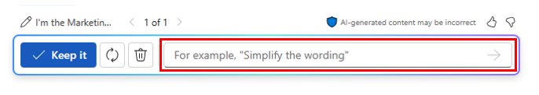

# دمج تقارير التسويق المتعددة باستخدام Microsoft 365 Copilot في Word
---
Microsoft 365 Copilot في Word هو مساعد كتابة قائم على تكنولوجيا الذكاء الاصطناعي يمكنه مساعدة محترفي التسويق على إنشاء المستندات بكفاءة أكبر. في مستند به محتوى، يمكن أن يساعدك Copilot في تحويل المحتوى. يمكنه إعادة كتابة محتوى محدد، أو حتى تحويل محتوى محدد إلى جدول. يمكن أن يساعد Microsoft 365 Copilot في Word متخصصي التسويق في توفير الوقت والجهد عند إنشاء المستندات. يمكنه مساعدتك في إنشاء المحتوى وإعادة كتابة النص وتقديم اقتراحات مفيدة. بفضل مساعد الكتابة القائم على تكنولوجيا الذكاء الاصطناعي، يمكن أن يساعدك تطبيق Copilot في إنشاء المستندات بكفاءة وفعالية أكبر.

يمكن أن يساعد Microsoft 365 Copilot في Word متخصصي التسويق بعدة طرق، مثل:

 -  **إنشاء محتوى جذاب**. يمكن أن يساعد Microsoft 365 Copilot في Word متخصصي التسويق في إنشاء محتوى جذاب لمدوناتهم ووسائل التواصل الاجتماعي.
 -  **تحليل تعليقات العملاء**. يمكن أن يساعد Microsoft 365 Copilot في Word متخصصي التسويق في تحليل تعليقات العملاء وبيانات المشاركة لتحديد الاتجاهات والرؤى. بإمكانهم استخدام هذه المعلومات لتخصيص استراتيجيات التسويق المستقبلية، مما يؤدي إلى زيادة التفاعل عبر الإنترنت والوصول إلى العملاء.
 -  **إنشاء تقارير تسويقية**. يمكن أن يساعد Microsoft 365 Copilot في Word متخصصي التسويق في إنشاء تقارير حول حملاتهم التسويقية، بما في ذلك البيانات المتعلقة بمشاركة العملاء ومعدلات التحويل والعائد على الاستثمار (ROI).
 -  **تحسين التواصل عبر البريد الإلكتروني**. يمكن أن يساعد Microsoft 365 Copilot في Word متخصصي التسويق في تحسين استجاباتهم للبريد الإلكتروني ووضع استراتيجيات لتكتيكات جذب العملاء، وضمان التواصل السريع والفعال.
 -  **إعداد جداول أعمال الاجتماعات**. يمكن أن يساعد Microsoft 365 Copilot في Word متخصصي التسويق في إعداد جداول أعمال الاجتماعات، والتأكد من تغطية جميع الموضوعات المهمة وأن الاجتماعات مثمرة وموجهة نحو النتائج.

في هذا التمرين، يمكنك استخدام Microsoft 365 Copilot في Word لإنشاء تقرير واحد عن طريق دمج ثلاثة تقارير منفصلة في تقرير واحد. يمكنك بعد ذلك استخدام Copilot لتعديل التقرير بمعلومات إضافية.

عند استخدام Microsoft 365 Copilot في Word لإنشاء مستند جديد، فإنه يقوم بإنشاء مسودة للمستند. إذا طلبت من Copilot إضافة أو تغيير شيء ما في المستند، فسيقوم بإعادة إنشاء مسودة جديدة للمستند مع التغييرات المطبقة. تستمر في العمل في وضع المسودة الخاص بـ Copilot، حيث يقوم Copilot بإجراء جميع التغييرات المطلوبة لك. بمجرد رضاك عن المسودة الأخيرة، حدد زر **الاحتفاظ بها**. يؤدي القيام بذلك إلى تغيير المستند من مسودة Copilot إلى مستند Word. إذا حاولت تغيير أي شيء يدويًا أثناء وجودك في وضع المسودة، فستختفي نافذة Copilot. على الرغم من أنه يمكنك تحديد أيقونة Copilot على شريط Word لفتح جزء Copilot، إلا أن خيار **إعادة الإنشاء** غير متاح، نظرًا لأنك لم تعد تعمل في وضع مسودة Copilot.

### تمرين

بصفتك مدير التسويق لمنطقة أمريكا اللاتينية (LATAM) في شركة Contoso Beverage، وهي قسم من شركة Contoso, Ltd.، فقد قدم لك مدير المنتج ثلاثة تقارير منفصلة تتعلق بمشروب شاي تشاي ميستيك سبايس الفاخر الخاص بالشركة. ومع ذلك، فإنك تجد صعوبة في تحليل المعلومات، لأنك تتنقل باستمرار بين المستندات.

قررت استخدام Microsoft 365 Copilot في Word لدمج التقارير في تقرير تحليل سوق LATAM واحد لشاي تشاي ميستيك سبايس الفاخر. بمجرد أن يقوم Copilot بإنشاء هذا التقرير، سترغب في مراجعته وربما تحديثه بمعلومات أخرى يمكن لـ Copilot العثور عليها في سوق شاي تشاي في أمريكا اللاتينية.

نفّذ الخطوات التالية لإنشاء تقرير تحليل السوق هذا باستخدام Microsoft 365 Copilot في Word:

1.  حدّد الرابط التالي لتنزيل نسخة من [وصف منتج شاي تشاي ميستيك سبايس الفاخر](https://go.microsoft.com/fwlink/?linkid=2268929).
2.  حدد الرابط التالي لتنزيل نسخة من [اتجاهات سوق شاي تشاي من Contoso لعام 2023](https://go.microsoft.com/fwlink/?linkid=2269122).
3.  حدد الرابط التالي لتنزيل نسخة من [خطة الترويج لشاي تشاي في أمريكا اللاتينية](https://go.microsoft.com/fwlink/?linkid=2269126).
4.  بمجرد اكتمال التنزيل، افتح **مستكشف الملفات** وانقل الملفات من مجلد **التنزيلات** إلى مجلد في حسابك على OneDrive.
5.  في هذا التمرين، يمكنك الوصول إلى المستندات من قائمة الملفات الأكثر استخدامًا مؤخرًا (MRU). لإظهار الملفات في قائمة الملفات الأكثر استخدامًا مؤخرًا (MRU)، افتح كل ملف من الملفات الثلاثة في حسابك OneDrive وأغلقه.
6.  في **Microsoft 365**، افتح **Microsoft Word**، ثم افتح مستندًا فارغًا جديدًا.
7.  في نافذة **صياغة مسودة باستخدام Copilot** التي تظهر في الجزء العلوي من المستند الفارغ، أدخل المطالبة التالية، ولكن لا تحدد زر **إنشاء** إلا بعد ربط الملفات الثلاثة بالمطالبة:
    
    **أنا مدير التسويق في أمريكا اللاتينية لشركة Contoso Beverage. يُرجى إنشاء تقرير تحليل السوق في أمريكا اللاتينية لمشروب شاي تشاي ميستيك سبايس الفاخر. اجمع بين الملفات الثلاثة المرفقة لإنشاء تقرير يصف المنتج ويحلل اتجاه السوق له ويتضمن خطة ترويجية لأمريكا اللاتينية**.
8.  يتعين عليك الآن إرفاق المستندات الثلاثة بالمطالبة. في نافذة **صياغة مسودة باستخدام Copilot**، حدد زر **الإشارة إلى محتواك**. في القائمة المنسدلة التي تظهر، إذا ظهر الملف **Mystic Spice Premium Chai Tea product description.docx** في قائمة الملفات، فحدده. وإلا، فحدد **تصفح الملفات من السحابة**، وحدد الملف من قائمة الملفات **الأخيرة**، ثم حدد الزر **إرفاق**. لاحظ كيفية عرض الملف في المطالبة.
9.  كرر الخطوة السابقة لكل من ملف **Contoso Chai Tea market trends 2023.xlsx** وملف **Promotion Plan for Chai Tea in Latin America.docx**. في هذه المرحلة، يجب أن تظهر الروابط لجميع الملفات الثلاثة في المطالبة.
10. حدد **إنشاء**. عند القيام بذلك، يستخرج Copilot المعلومات ذات الصلة من الملفات الثلاثة ويضع تقريرًا يجمعها في تقرير تحليل السوق واحد لشاي تشاي ميستيك سبايس الفاخر.
11. بعد مراجعة هذه المسودة الأولية لتقرير تحليل السوق، ستدرك أنها تفتقد بعض المعلومات الهامة. ترغب في أن تتضمن قسمًا بعنوان **التحليل التنافسي**. تريد من Copilot تحليل المنافسة. للقيام بذلك، أدخل المطالبة التالية في نافذة Copilot في أسفل التقرير، ثم حدد السهم **إنشاء**:
    
    
    
    
    **يبدو هذا التقرير جيدًا. ومع ذلك، يُرجى إضافة قسم بعنوان "التحليل التنافسي". راجع شركات المشروبات في أمريكا اللاتينية التي تبيع شاي تشاي، ثم قدم معلومات في هذا القسم حول نقاط القوة والضعف لدى هذه الشركات المنافسة، وحصتها في السوق، واستراتيجيات التسعير الخاصة بها**.
12. بعد مراجعة هذه المسودة الثانية من التقرير الذي يحتوي على قسم التحليل التنافسي الجديد، ستدرك أن هناك شيئًا أخيرًا مفقودًا. تريد من Copilot إضافة قسم حول **قنوات التوزيع**. ينبغي لهذا القسم أن يحلل قنوات التوزيع المستخدمة لبيع شاي تشاي في أمريكا اللاتينية. للقيام بذلك، أدخل المطالبة التالية في نافذة Copilot في أسفل التقرير، ثم حدد السهم **إنشاء**:
    
    **عمل جيد! شيء أخير. يُرجى إضافة قسم بعنوان قنوات التوزيع. راجع قنوات التوزيع المستخدمة لبيع شاي تشاي في أمريكا اللاتينية ثم قدّم معلومات في هذا القسم حول أنواع تجار التجزئة والجملة والموزعين المستخدمين**.
13. بعد مراجعة هذه المسودة الأخيرة التي تحتوي على قسم قنوات التوزيع الجديد، أصبحت راضيًا عن التقرير وجاهزًا لحفظه. في نافذة Copilot الموجودة أسفل المستند، حدد الزر **الاحتفاظ به** لتحويله من مسودة Copilot إلى مستند Word.
14. راجع المستند. إذا كنت ترغب في إجراء أي تغييرات يدوية، يمكنك القيام بذلك الآن. بمجرد أن تكون راضيًا عنه، لا تتردد في حفظ المستند على OneDrive إذا كنت ترغب في الاحتفاظ به للرجوع إليه في المستقبل، أو يمكنك فقط التخلص منه.
15. أغلق علامة التبويب هذه في متصفحك Microsoft Edge.
