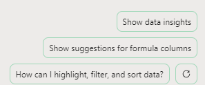
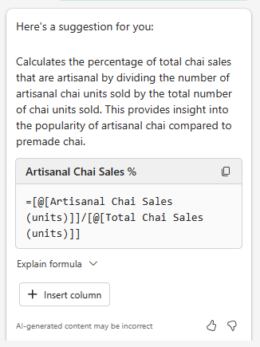

# تحليل جدول بيانات اتجاهات السوق باستخدام Microsoft 365 Copilot في Excel
---
يمكن لمحترفي التسويق استخدام Microsoft 365 Copilot في Excel لتحليل بياناتهم والحصول على رؤى ثاقبة حول أعمالهم. Microsoft 365 Copilot في Excel هو أداة قوية يمكنها مساعدة محترفي التسويق على إنشاء بياناتهم وتحريرها وفهمها وتصورها بسهولة.

على سبيل المثال، يمكنهم استخدام Microsoft 365 Copilot في Excel لتحليل نتائج الأعمال الفصلية، وتلخيص الاتجاهات الرئيسية، وتطبيق الترميز اللوني على الجداول، وإنشاء النماذج والسيناريوهات، والتصفية والفرز، وإضافة المخططات البيانية بنقرة واحدة على الماوس. يمكن أن تساعد قدرات Copilot القائمة على تكنولوجيا الذكاء الاصطناعي متخصصي التسويق في توفير الوقت والجهد من خلال أتمتة المهام المتكررة وتوفير رؤى قيمة يمكن أن تساعدهم في اتخاذ قرارات مستنيرة. باستخدام Microsoft 365 Copilot في Excel، يمكنهم التركيز على ما هو أكثر أهمية - أهدافهم وأغراضهم التجارية.

يعد Microsoft 365 Copilot في Excel أداة لا تقدر بثمن في مجموعة أدوات محترفي التسويق. فهو يوفر مجموعة كبيرة من الفوائد، بما في ذلك:

 -  **تمييز البيانات وتصفيتها وفرزها بسهولة**: يمكن أن يساعد Microsoft 365 Copilot في Excel محترفي التسويق في تحديد البيانات وتنظيمها بسرعة من خلال تمييزها وتصفيتها وفرزها. على سبيل المثال، يمكن لمحترف التسويق استخدام Copilot لتصفية البيانات غير ذات الصلة من مجموعة بيانات كبيرة، مثل التركيبة السكانية للعملاء، والتركيز على البيانات الأكثر صلة بأهدافهم التسويقية.
 -  **إنشاء اقتراحات لأعمدة الصيغ لإجراء حسابات معقدة**: يمكن أن يساعد Microsoft 365 Copilot في Excel محترفي التسويق في إنشاء اقتراحات لأعمدة الصيغ لإجراء حسابات معقدة، مثل حساب العائد على الاستثمار (ROI) لحملاتهم التسويقية. على سبيل المثال، يمكن لمحترف التسويق استخدام Copilot لحساب عائد الاستثمار لحملة التسويق عبر البريد الإلكتروني الخاصة به عن طريق تقسيم الإيرادات الناتجة عن الحملة على تكلفة الحملة الإعلانية.
 -  **المساعدة في تحليل البيانات وفهمها وتصورها**: يمكن أن يساعد Microsoft 365 Copilot في Excel محترفي التسويق في تحليل بياناتهم وفهمها وتصورها باستخدام قوة الذكاء الاصطناعي. على سبيل المثال، يمكن لمحترف التسويق استخدام Copilot لتحديد الاتجاهات في بيانات المبيعات الخاصة به واستخدام هذه الرؤى لاتخاذ قرارات مستنيرة حول استراتيجيات التسويق الخاصة به.

عند استخدام Microsoft 365 Copilot في Excel، يجب أن يكون لديك جدول Excel يتضمن بيانات في ورقة عمل. بإمكانك تحويل نطاق من الخلايا إلى جدول Excel بسرعة باتباع الخطوات التالية:

1.  حدد الخلية أو النطاق في البيانات.
2.  حدد تنسيق **الصفحة الرئيسية**&gt;**كجدول**.
3.  في مربع الحوار **تنسيق كجدول**، حدد مربع الاختيار بجوار **يحتوي الجدول على عناوين** إذا كنت تريد أن يكون الصف الأول من النطاق هو صف العنوان.
4.  حدد **موافق**.

في هذا التمرين، يمكنك استخدام Microsoft 365 Copilot في Excel لتحليل جدول بيانات اتجاهات السوق الذي يحتوي بالفعل على جدول Excel محدد. يتناول هذا التمرين العديد من الوظائف والمطالبات المعدة مسبقًا في Copilot. 

### تمرين

بصفتك مدير التسويق لشركة Contoso Beverage، وهي قسم من شركة Contoso, Ltd.، فقد تلقيت جدول بيانات لاتجاهات السوق يوضح النشاط الشهري لمنتج شاي تشاي من Contoso في عام 2023. تريد استخدام ميزات Microsoft 365 Copilot في Excel لتحليل التقرير وتوفير تحليل مفصل لاتجاهات التسويق الشهرية في عام 2023. في هذا التمرين، ستقوم بمراجعة المطالبات والميزات المحددة مسبقًا التي يوفرها Microsoft 365 Copilot في Excel.

نفّذ الخطوات التالية لتحليل جدول بيانات اتجاه السوق باستخدام Microsoft 365 Copilot في Excel:

1.  إذا أنزلت جدول بيانات [Contoso Chai Tea market trends 2023](https://go.microsoft.com/fwlink/?linkid=2268822) في التمرين السابق، فانتقل إلى الخطوة التالية. بخلاف ذلك، حدد الرابط لتنزيل الملف، وانقله إلى حسابك على OneDrive، ثم افتح الملف وأغلقه لوضعه في قائمة الملفات الأكثر استخدامًا مؤخرًا (MRU).
2.  إذا كان لديك علامة تبويب Microsoft 365 مفتوحة في متصفح Microsoft Edge، فحددها الآن؛ وإلا، فافتح علامة تبويب جديدة وأدخل عنوان URL التالي: **https://www.office.com**
3.  في الصفحة الرئيسية لـ **Microsoft 365**، حدد أيقونة **Excel** في جزء التنقّل الموجود على اليسار.
4.  في **Excel**، في صفحة **ملف**، حدد **Contoso Chai Tea market trends 2023.xlsx** من قائمة الملفات.
5.  حدد خيار **Copilot** على الجانب الأيمن من الشريط.
6.  في جزء **Copilot** الذي يظهر، تتوفر العديد من المطالبات المعرفة مسبقًا للاختيار من بينها. حدد زر **إظهار رؤى البيانات**.
    
  
    
7.  لاحظ الرسم البياني المحوري الذي تم إنشاؤه. عندما اختبرنا هذا التمرين، قام Copilot دائمًا بإنشاء رسم بياني خطي لـ **التفاعل على وسائل التواصل الاجتماعي (المشاهدات) حسب التاريخ**. ما نوع الرسم البياني الذي أنشأه لك Copilot؟ أسفل الرسم البياني الذي أنشأه لك Copilot، حدد الزر **+إضافة إلى ورقة جديدة**.
8.  حدد **الورقة 2**. راجع ورقة البيانات الجديدة التي أنشأها Copilot. تضمن Microsoft 365 Copilot كلًا من الرسم البياني وعمود البيانات من جدول البيانات الذي كان يشكل أساس هذا الرسم البياني. ضع المؤشر فوق الرسم البياني ولاحظ النافذة التي تظهر والتي تشير إلى نوع الرسم البياني الذي أنشأه Copilot.
9.  لاحظ كيف لم تعد قائمة المطالبات المحددة مسبقًا تظهر في جزء Copilot. يحدث هذا الموقف لأن Copilot لا يعمل على PivotTables حتى الآن (لاحظ الرسالة التي تشير إلى هذه المشكلة). حدّد **الورقة 1**، مما سيعيدك إلى جدول Excel. لاحظ كيفية ظهور المطالبات المعرفة مسبقًا.
10. في المطالبات المحددة مسبقًا التي تظهر أعلى حقل المطالبة، حدد الزر **إظهار الاقتراحات لأعمدة الصيغة**.
11. لاحظ الاقتراح الذي قدمه Copilot. تُظهر الصورة التالية الاقتراح الذي قدمه Copilot أثناء اختبارنا.
    
   
    
12. في الاقتراح الذي تلقيته، حدد سهم القائمة المنسدلة **شرح الصيغة**. راجع شرح Copilot الذي يصف الحساب. حدد الزر **+إدراج عمود** لإدراج هذا العمود في جدول Excel الخاص بك.
13. لاحظ كيف قام Copilot بإضافة عمود البيانات هذا إلى نهاية جدول Excel في **الورقة 1**. لقد أثارت هذه الميزة اهتمامك، لذا فأنت تريد الآن رؤية اقتراحات الصيغ الأخرى التي تقدمها. حدّد زر **إظهار الاقتراحات لأعمدة الصيغة** مرة أخرى. لاحظ الاقتراح. حدد الزر **+إدراج عمود** لإدراج هذا العمود المقترح في جدول Excel الخاص بك.
14. في المطالبات المحددة مسبقًا التي تظهر أعلى حقل المطالبة، حدد الزر **كيف يمكنني تمييز البيانات وتصفيتها وفرزها**؟
15. لاحظ قائمة الإجراءات التي يمكنك اتخاذها.
16. راجع القائمة المنقحة للمطالبات المعرفة مسبقًا التي تظهر الآن. تُظهر الصورة التالية أمثلة للمطالبات التي تلقيناها أثناء اختبارنا.
    
   
    
17. الغرض من هذا التمرين هو الشعور بالأنواع المختلفة من الإجراءات المحددة مسبقًا التي يمكن لـ Copilot القيام بها. لذلك، حدد مطالبات مختلفة لمعرفة ما يحدث. على سبيل المثال:
     -  إذا ظهرت لك مطالبة **الفرز**، فحددها الآن. لاحظ كيف قام Copilot بفرز البيانات نيابة عنك.
     -  إذا ظهرت مطالبة **غامقة**، فحددها الآن. لاحظ كيف قام Copilot بتظليل العناصر الموجودة في العمود الذي ذكره وترك العناصر الأخرى بدون تظليل.
     -  إذا ظهرت لك مطالبة **التمييز**، فحددها الآن. لاحظ رد Copilot وكيفية تمييزه للبيانات الموجودة في الجدول.
18. في هذه المرحلة، لم تعد المطالبات المحددة مسبقًا التي يعرضها Copilot تثير اهتمامك. وبناءً على ذلك، فأنت تريد رؤية مجموعة جديدة من المطالبات. حدد زر **تحديث** الذي يظهر أعلى حقل المطالبة.
    
   
    
    
19. راجع المجموعة الجديدة من المطالبات التي يتم عرضها. حدّد زر **تحديث** عدة مرات لرؤية أنواع المطالبات المختلفة التي يوفرها Copilot.
20. لا تتردد في تحديد أي مطالبات أخرى لرؤية ما يفعله Copilot. عند الانتهاء، أغلق علامة التبويب الخاصة بمتصفحك Microsoft Edge.
