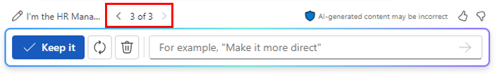

# إنشاء وصف وظيفة باستخدام Microsoft 365 Copilot في Word
---
Microsoft 365 Copilot في Word هو مساعد كتابة قائم على تكنولوجيا الذكاء الاصطناعي يمكنه مساعدة متخصصي الموارد البشرية على تبسيط عمليات العمل الخاصة بهم وتحسين إنتاجيتهم. يمكن أن يساعد Copilot متخصصي الموارد البشرية بطرق مختلفة، بما في ذلك فحص السيرة الذاتية الآلي، والمساعدة في وصف الوظيفة، والإلحاق الفعال، وتحليل تعليقات الموظفين، والمزيد.

على سبيل المثال، يمكن لـ Copilot أتمتة المراحل الأولية لعملية فحص السيرة الذاتية، مما يساعد خبراء الموارد البشرية على تحديد المرشحين الأكثر ملاءمة بسرعة من بين مجموعات كبيرة من المتقدمين. يمكن لـ Copilot أيضًا تبسيط التعامل مع مستندات الإلحاق، من إنشاء العقد إلى نشر السياسة، مما يجعل عملية الإلحاق أكثر كفاءة. بالإضافة إلى ذلك، يمكن أن يساعد في إنشاء خطط إلحاق مخصصة للموظفين الجدد، مما يضمن شعورهم بالترحيب والمعرفة الجيدة منذ اليوم الأول.

يمكن لـ Microsoft 365 Copilot في Word أيضًا تحليل تعليقات الموظفين واستطلاعات الرأي، مما يوفر لمحترفي الموارد البشرية رؤى حول رضا الموظفين ومجالات التحسين. يمكنه اقتراح برامج تدريب وتطوير مخصصة للموظفين، مما يعزز مهاراتهم وتقدمهم الوظيفي.

### تمرين

بصفتك مدير الموارد البشرية في معهد التصميم الجرافيكي، بدأت عملية توظيف كبير مصممي الرسوم المتحركة جديد. أنشأ موظفوك مستندًا يحدد جميع المسؤوليات الوظيفية لهذا الدور. تريد الآن استخدام Microsoft 365 Copilot في Word لإنشاء وصف وظيفة استنادًا إلى مسؤوليات الدور في هذا المستند.

1.  حدّد الرابط التالي لتنزيل وثيقة [معهد التصميم الجرافيكي - مسؤوليات فريق التصميم](https://go.microsoft.com/fwlink/?linkid=2268824).
2.  بعد اكتمال التنزيل، انقل الملف إلى حسابك على OneDrive، ثم افتح الملف وأغلقه ليظهر لك في قائمة الملفات الأكثر استخدامًا مؤخرًا (MRU).
3.  إذا كان لديك علامة تبويب Microsoft 365 مفتوحة في متصفح Microsoft Edge، فحددها الآن؛ وإلا، فافتح علامة تبويب جديدة وأدخل عنوان URL التالي: **https://www.office.com**
4.  في **Microsoft 365**، افتح **Microsoft Word**، ثم افتح مستندًا فارغًا.
5.  في نافذة **صياغة مسودة باستخدام Copilot**، أدخل المطالبة التالية، ولكن لا تحدد زر **إنشاء** إلا بعد ربط ملف المسؤوليات بالمطالبة في الخطوة التالية:
    
    **أنا مدير الموارد البشرية في معهد التصميم الجرافيكي. لقد بدأنا حاليًا عملية توظيف كبير مصممي الرسوم المتحركة جديد. يرجى مراجعة المستند المرفق الذي يحدد مسؤوليات الوظيفة لهذا الدور وإنشاء وصف وظيفي بناءً على تلك المسؤوليات**.
6.  يتعين عليك الآن إرفاق الملف **Graphic Design Institute - Design Team Responsibilities.docx** الذي قمت بتنزيله بالمطالبة. في نافذة **صياغة مسودة باستخدام Copilot**، حدد زر **الإشارة إلى محتواك**. في القائمة المنسدلة التي تظهر، إذا ظهر الملف **Graphic Design Institute - Design Team Responsibilities.docx** في قائمة الملفات، فحدده. وإلا، فحدد **تصفح الملفات من السحابة**، وحدد الملف من قائمة الملفات **الأخيرة**، ثم حدد الزر **إرفاق**. إذا لم يظهر الملف في قائمة الملفات **الأخيرة**، فحدد **ملفاتي** في الجزء العلوي من جزء التنقل في نافذة **اختيار ملف**، وانتقل إلى المجلد الذي قمت بتخزين الملف فيه، وحدد الملف، ثم حدد **إرفاق**. لاحظ كيفية عرض الملف في المطالبة.
7.  حدد **إنشاء**.
8.  راجع المسودة الأولى لمستند وصف الوظيفة. تجدر الإشارة إلى أنه لا يتضمن العديد من التفاصيل الموجودة في مستند المسؤوليات الوظيفية. وبدلًا من ذلك، فإنه يوفر جملة أو جملتين موجزتين لكل مسؤولية. لتصحيح هذا الخلل، أدخل المطالبة التالية وحدد السهم للأمام:
    
    **على الرغم من أن مسودة وصف الوظيفة هذه تعتبر بداية جيدة، إلا أنك فشلت في تضمين معظم التفاصيل الموجودة في وثيقة مسؤوليات الوظيفة. يُرجى المحاولة مرة أخرى، وهذه المرة حدّد كل مجال من مجالات المسؤولية وتحديد المسؤوليات المطلوبة من كبير مصممي الرسوم المتحركة**.
9.  مراجعة المسودة الثانية مرة أخرى، تشعر أن Copilot يجب أن يقدم المزيد من التفاصيل. أدخل المطالبة التالية لمعرفة ما إذا كان يمكنك الحصول عليها لتكون أكثر تحديدًا:
    
    **مسودة وصف الوظيفة هذه أفضل، لكنها لا تزال تفتقر إلى التفاصيل التي أبحث عنها. لقد حدد مستند مسؤوليات الوظيفة المسؤوليات التفصيلية لكل مجال. ضمّن هذه التفاصيل في وصف الوظيفة هذا. كُن محددًا قدر الإمكان**.
10. بعد مراجعة النتائج، ستتذكر المثل القائل: "كُن حذرًا مما ترغب فيه". إن قائمة المسؤوليات في هذه المسودة الثالثة طويلة؛ في الواقع، ربما تكون طويلة للغاية بالنسبة لمستند وصف وظيفي قابل للتنفيذ. في هذه المرحلة، عليك مراجعة المسودات السابقة لمعرفة ما إذا كانت المسودات السابقة ربما تكون أفضل من هذه المسودات الأطول. في نافذة Copilot، أعلى حقل المطالبة مباشرةً، لاحظ مسودة الإصدار الحالي من المستند. في هذه الحالة، أنت في المسودة 3 من 3. لمراجعة مسودة سابقة، حدد السهم للخلف (&lt;) للرجوع إلى المسودتين الثانية والأولى. استخدم الأسهم الأمامية (&gt;) للرجوع إلى المسودات الأخيرة.
    
    
    
    
    في هذه الحالة، ارجع إلى المسودة الثانية. راجع قائمة المسؤوليات مرة أخرى. على الرغم من أنها ليست واسعة النطاق مثل القائمة الموجودة في المسودة الثالثة، إلا أنها تبدو أنظف ولا تزال توفر معلومات كافية للمرشح للوظيفة لفهم ما هو متوقع منه في دور كبير مصممي الرسوم المتحركة هذا. لقد قررت أن المسودة الثانية أفضل من المسودة النهائية، لذا اخترت استخدام هذه المسودة. في نافذة Copilot، حدد الزر **الاحتفاظ به**.
11. أنت مستعد للمضي قدمًا في مستند وصف الوظيفة هذا، لذا احفظه في حسابك OneDrive باسم الملف **Graphic Design Institute - Job descriptions.docx.**

    > **ملاحظة:** من المهم أن تحفظ هذا المستند لأنك ستستخدمه في التمرين التالي.
