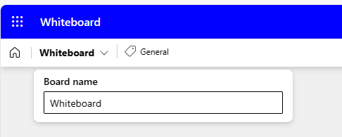

# تبادل الأفكار لخطة مشروع باستخدام Microsoft 365 Copilot في Whiteboard
---
Microsoft Whiteboard هو لوحة رقمية تسمح للمستخدمين بالتعاون في الوقت الحقيقي، وتبادل الأفكار، وإنشاء المحتوى بسهولة. إنها أداة متعددة الاستخدامات يمكن لمحترفي الأعمال استخدامها لأغراض مختلفة، مثل إدارة المشاريع والتفكير التصميمي والتعليم. تتضمن ميزات Whiteboard رسمًا حرًا وملاحظات ملصقة وقوالب يمكنك تخصيصها لتناسب احتياجاتك.

يمكن لمديري العمليات الاستفادة من Microsoft Whiteboard بعدة طرق. يمكن أن تساعد Whiteboard في زيادة التعاون من خلال السماح لعدة مستخدمين بالعمل في وقت واحد في مساحة رقمية، ما يجعل من السهل مشاركة المرئيات والأفكار. كما توفر مساحة يمكنك استخدامها للمشاريع، وتبادل الأفكار، وورش العمل، والاسترجاعات، والتصميم، والتخطيط الاستراتيجي، وحل المشكلات التي قد تحتوي على قطع متحركة أو تحتاج إلى المزيد من المرئيات. يمكن أن تساعد Whiteboard في زيادة الإنتاجية من خلال توفير مساحة للرسم التخطيطي للنماذج الأولية أو مشاركتها أو تجميع قائمة بأفكار اسم المنتج.

في هذا التدريب، أنت تقوم بدور مدير العمليات الذي يريد تثبيت غلاية جديدة في نظام التدفئة في مبناك. هدفك طويل المدى هو إنشاء خطة مشروع لعملية التركيب. تريد استخدام Microsoft 365 Copilot في Whiteboard لاقتراح الخطوات اللازمة لإكمال عملية التركيب هذه. فكر في هذا التدريب على أنه في الأساس تدريب ملاحظات ملصقة بمساعدة الذكاء الاصطناعي.

هل سبق لك أن شاركت في جلسة تبادل أفكار قبل أن تتضمن ملاحظات ملصقة؟ يكتب حاضرو الاجتماع أفكارًا على ملاحظات ملصقة ثم يلصقونها على سبورة أو على جدار. من هناك، يعيد قائد الاجتماع ترتيب الملاحظات من خلال تنظيمها في فئات مختلفة، ويزيل الأفكار المكررة، ويحرر الأفكار للتوضيح، وما إلى ذلك. عند الانتهاء من جلسة العمل، ينتهي بك الأمر بأكوام من الأفكار، المنظمة في فئات.

حسنًا، هذا هو التدريب حقًا - مجرد تدريب افتراضي بالملاحظات اللاصقة، كل ذلك بمساعدة Microsoft 365 Copilot في Whiteboard. ومع ذلك، في هذه الحالة، بدلًا من وجود غرفة مليئة بالأشخاص الذين يتبادلون الأفكار ويكتبونها على ملاحظات ملصقة، يحل Copilot مكانهم. شاهد كيف يقوم Copilot بإنشاء قائمة من الأفكار، وكتابة كل واحدة منها على ملاحظة لاصقة مرسومة، ووضع الملاحظات على لوحة Whiteboard الخاصة بك. بصفتك مدير الاجتماع، يمكنك بعد ذلك تحرير أي من هذه الملاحظات وحذفها. وبعد ذلك مع وجود القائمة النهائية للملاحظات، ستجعل Copilot ينظم الملاحظات الملصقة في فئات مختلفة. يساعد القيام بذلك على تنظيم الوثائق في المستقبل ويساعد على ضمان عدم تجاهل أي من الملاحظات عند إنشاء خطة المشروع.

### تمرين

بصفتك مدير العمليات في شركة Adatum، فأنت تخطط لتركيب غلاية جديدة في نظام التدفئة في المبنى. ومع ذلك، قبل بدء عملية التركيب، تريد استخدام Microsoft 365 Copilot في Whiteboard لاقتراح الخطوات المحتملة التي تقوم بها الشركات عادة عند تحديث نظام التدفئة الخاص بها. ثم تطلب من Copilot تصنيف جميع الاقتراحات لتسهيل العثور على الأفكار ذات الصلة وتجميعها معًا. يساعد استخدام Microsoft 365 Copilot في Whiteboard بهذه الطريقة على تسهيل المناقشات المستقبلية التي تخطط لإجراءها مع فريقك والتي تتضمن عملية التركيب.

1.  في متصفح Microsoft Edge، افتح علامة تبويب جديدة وأدخل عنوان URL التالي للانتقال إلى الصفحة الرئيسية لـ Microsoft 365: **https://www.office.com**
2.  في صفحة **Microsoft 365** الرئيسية، إذا ظهرت أيقونة **Whiteboard** في جزء التنقل الأيسر، فحددها الآن وانتقل إلى الخطوة التالية. وإلا، حدد أيقونة **التطبيقات**، وفي صفحة **التطبيقات**، قم بالتمرير لأسفل وصولًا إلى قسم **استكشاف حسب الفئة**، وفي علامة تبويب **الإنتاجية** (التي يجب عرضها بشكل افتراضي)، حدد **Whiteboard **.
3.  قم بتسجيل الدخول إلى **Microsoft Whiteboard**.
4.  في الصفحة الرئيسية لـ **Whiteboard** حدد **New Whiteboard**.
5.  في الشريط في أعلى الصفحة، حدد السهم القائمة المنسدلة لـ **Whiteboard**. في حقل **اسم اللوحة**، أدخل **خطة مشروع تركيب المِرجَل** ثم حدد أيقونة علامة الاختيار.

 
    
7.  إذا ظهرت نافذة **اقتراح محتوى بواسطة Copilot**، فانتقل إلى الخطوة التالية. وإلا، في مجموعة الأيقونات التي تظهر أعلى شريط المهام في أسفل الصفحة، حدد أيقونة **Copilot**. في القائمة التي تظهر، حدد **اقتراح**.
8.  في نافذة **اقتراح محتوى باستخدام Copilot**، أدخل المطالبة التالية:
    
    **أنا مدير العمليات لشركة Adatum. نحن نقوم بتركيب غلاية جديد في نظام التدفئة لدينا. يرجى اقتراح الخطوات التي يجب اتباعها لتركيب الغلاية الجديدة**.
9.  إذا ظهرت نافذة **اقتراح محتوى بواسطة Copilot**، فانتقل إلى الخطوة التالية. ومع ذلك، إذا تلقيت رسالة تشير إلى أن "**حدث خطأ ما. يرجى المحاولة مرة أخرى.**" أو "**تعذر على Copilot معالجة هذه المطالبة. يرجى إعادة صياغتها.**" ثم حدد سهم **اقتراحات الإنشاء** في الزاوية السفلية من نافذة Copilot.
    
    
    
    
    في بعض الأحيان يكمل Copilot العملية التي يعمل عليها ولكنه يتعثر قليلًا قبل عرض النتائج. عند تحديد قسم **إنشاء اقتراحات** مرة أخرى، فإنه يعرض النتائج عادة دون تأخير كبير. ومع ذلك، إذا تلقيت رسالة مماثلة مرة ثانية، فحدد سهم **إنشاء اقتراحات**عدة مرات أخرى. إذا استمر تلقي هذا الخطأ بعد ثلاث أو أربع محاولات، فبسّط المطالبة بإدخال النص التالي:
    
    **يرجى اقتراح الخطوات التي يجب أن نتبعها لتركيب غلاية جديدة في نظام التدفئة في المبنى**.
10.  بشكل افتراضي، ينشئ Copilot أفكارًا في مجموعات من ستة أفكار. في نافذة **اقتراح المحتوى باستخدام Copilot** التي تظهر، لاحظ الأفكار الستة الأولى التي أنشأها. يوفر لك Copilot خيارين هنا - يمكنك إما إرفاق الأفكار إلى لوح المعلومات الخاص بك إذا كنت راضيًا عن الاقتراحات، أو يمكنك جعل Copilot يقوم بإنشاء المزيد من الاقتراحات. لاحظ كيف يشير زر **إدراج (6)** إلى عدد الأفكار التي أنشأها Copilot - في هذه الحالة، 6 أفكار. في حين أن ستة اقتراحات هي نقطة بداية جيدة، فأنت تريد التعمق في المهام اللازمة لتركيب منتج الأمان، لذا حدد زر **إنشاء المزيد**.

     > **ملاحظة:** إذا عرض Copilot رسالة خطأ من أي نوع، فحدد زر **إنشاء المزيد** مرة أخرى. قم بذلك في أي وقت تتلقى فيه رسالة خطأ. 
      
12. لاحظ كيف أنشأ Copilot ست أفكار أخرى، بحيث يعرض زر **إدراج (12)** الآن **12**. بينما يمكنك الاستمرار في إنشاء المزيد من الأفكار، من أجل توفير الوقت، دعنا ندرج الأفكار ال 12 المعروضة حاليًا. حدد زر **إدراج (12)**.
13. عند تحديد زر **إدراج**، يقوم Copilot بإرفاق الأفكار المقترحة إلى whiteboarding الخاص بك في شكل ملاحظات ملصقة صفراء. كما هو الحال مع جلسة تبادل الأفكار في العالم الحقيقي التي تتضمن ملاحظات ملصقة فعلية، يمكنك تحرير ملاحظة معينة أو حذفها أو تأمينها من الإزالة مستقبلًا، وما إلى ذلك. في Microsoft Whiteboard، يتم دعم هذه الأنشطة من خلال وظائف whiteboarding القياسية.
    
    إذا لم يسبق لك استخدام Whiteboard من قبل، فحاول تحديد (انقر نقرًا مزدوجًا) ملاحظة معينة، ثم في شريط القوائم الذي يظهر فوقها، يمكنك تحديد أيقونة **تحرير النص** (القلم الرصاص) أو أي من الخيارات الأخرى. يؤدي تحديد أيقونة علامة الحذف في نهاية شريط القوائم إلى عرض قائمة بمزيد من الخيارات، مثل حذف الملاحظة. مرة أخرى، تكمن الفكرة وراء Microsoft Whiteboard في محاكاة التدريبات التي تتم في العالم الحقيقي والتي تستخدم الملاحظات اللاصقة. لا تتردد في تحرير أي ملاحظة كما تريد.
14. عند النظر إلى الأفكار المقترحة، تشعر أنها لا تغطي التخفيف من المخاطر بشكل كاف. حدد أيقونة **Copilot** في أسفل الصفحة ثم حدد **اقتراح** من القائمة.
15. في نافذة **اقتراح المحتوى بواسطة Copilot** التي تظهر، أدخل المطالبة التالية لإنشاء المزيد من الأفكار حول التخفيف من المخاطر:
    
    **اقترح طرقًا للتخفيف من مخاطر تركيب غلاية جديدة في نظام التدفئة في المبنى**.
16. راجع الأفكار الستة التي اقترحها Copilot. قد ترغب في أن يضمّن Copilot المزيد من التفاصيل، لذا حدد زر **إنشاء المزيد**.
17. أنت راضٍ عن 12 فكرة للتخفيف من المخاطر، لذا حدد زر **إدراج (12)**. لاحظ كيفية تحديد مجموعة الـ 12 فكرة للتخفيف من المخاطر (راجع الحدود الخارجية). إذا قام Copilot بوضع الـ 12 فكرة للتخفيف من المخاطر بشكل جزئي فوق أفكار خطة المشروع الـ 12 الأصلية، يمكنك تحديد مجموعة الأفكار هذه ونقلها عبر الشاشة بحيث لم تعد تغطي الأفكار الـ 12 الأصلية. لا تقلق بشأن محاذاة المجموعتين. بمجرد تنظيم الملاحظات في فئات في خطوة لاحقة، ستبدو جميلة ومرتبة. في الوقت الحالي، ما عليك سوى ترتيب كل مجموعة حتى تتمكن من رؤية جميع الأفكار. يوفر القيام بذلك الرؤية اللازمة لمعرفة المناطق التي اقترحها Copilot بحيث يمكنك تحرير أي منها إذا كنت ترغب في ذلك.
18. أنت الآن راضٍ عن الاقتراحات التي أنشأها Copilot، وقد أكملت جميع عمليات التحرير التي تريد إجراؤها على الملاحظات. تريد الآن أن ينظم Copilot الملاحظات حسب الفئة. يحدد Copilot أسماء الفئات وينظم الملاحظات تلقائيًا وفقًا لذلك. حدد أيقونة **Copilot** في أسفل الصفحة، ثم حدد **تصنيف** من القائمة.
19. لاحظ ماذا حدث. أنشأ Copilot مجموعة من الفئات وأعد تنظيم الملاحظات وفقًا لذلك. تم تعيين لون مختلف لكل فئة من الملاحظات للمساعدة في تحديد الاختلافات بين الفئات. إذا لم يكن المستطيل الذي يحتوي على الملاحظات كبيرًا بقدر ما يمكن أن يكون ولا يزال مناسبًا للشاشة، فحدد أيقونة **ملاءمة الشاشة** في الزاوية اليمنى السفلية من الصفحة. يؤدي القيام بذلك إلى زيادة حجم الصورة حتى لا تتمكن من زيادتها بعد الآن دون تجاوز حجم الشاشة.
20. لاحظ مجموعة الأيقونات التي تظهر أسفل مجموعة الملاحظات المنظمة. إذا لم تكن راضيًا عن الفئات، فحدد زر **إعادة إنشاء** على مجموعة الأيقونات التي تظهر.
    
    > **ملاحظة:** يمكنك تحديد زر **إعادة إنشاء** عدة مرات حسب الحاجة حتى تكون راضيًا عن الفئات التي يوفرها Copilot. حدد هذا الزر عدة مرات ولاحظ التغييرات التي يقوم بها Copilot في كل مرة. بالإضافة إلى تغيير أسماء الفئات، قد يضيف Copilot أو يقلل من عدد الفئات مع كل إعادة إنشاء.

21. بعد إعادة إنشاء الفئات عدة مرات، تدرك أنك تفتقد إلى خطوات مفصلة تتعلق بتقليل وقت تعطل النظام. تريد أن تطلب من Copilot إضافة المزيد من الأفكار إلى جلسة عمل Whiteboard فيما يتعلق بهذه المشكلة. بالإضافة إلى ذلك، قمت بتحديد ملاحظة تريد إزالتها. ومع ذلك، بما أنك قمت بالفعل بتنظيم أفكارك، يجب عليك تغيير جلسة عمل Whiteboard مرة أخرى إلى وضع التحرير الذي كنت عليه قبل تصنيف الملاحظات. للقيام بذلك، حدد زر **عودة**.
22. الآن بعد أن عدت إلى وضع التحرير، حدد ملاحظة لم تعد تريدها، ثم في مجموعة الأيقونات التي تظهر، حدد أيقونة علامة الحذف. حدد **حذف** من القائمة التي تظهر.
23. لجعل Copilot ينتج المزيد من الأفكار، حدد أيقونة **Copilot** في أسفل الصفحة، ثم حدد **اقتراح** من القائمة.
24. في نافذة **اقتراح محتوى باستخدام Copilot** التي تظهر، أدخل المطالبة التالية لتوليد المزيد من الأفكار حول تقليل وقت تعطل النظام:
    
    **اقتراح طرق للحد من تعطّل نظام التدفئة عند تركيب مرجل جديد**.
25. راجع الأفكار الستة التي اقترحها Copilot. أنت راضٍ عن هذه الأفكار، لذا حدد زر **إدراج (6)**.
26. لاحظ كيف تم تسليط الضوء على كتلة الملحوظات الستة بخط حول الكتلة. تُعرف كتلة الملحوظات هذه باسم شبكة الملاحظات. يمكنك نقل شبكة الملحوظات أو تغيير حجمها تمامًا مثل أي عنصر آخر على لوحة المعلومات الخاصة بك. عند تغيير حجم شبكة الملحوظات، يتم تعديل أحجام جميع الملحوظات اللاصقة الموجودة داخلها وفقًا لذلك. إذا كانت كتلة الملحوظات الست تتراكب فوق إحدى كتل الملحوظات، فحدد أحد الخطوط الخارجية حول شبكة الملحوظات واسحب كتلة الملحوظات الست بأكملها إلى الجانب حتى لا تتراكب فوق أي من الملحوظات السابقة. إذا نفدت المساحة على الشاشة وسقط جزء من الكتلة خارج الشاشة، فحدد أيقونة **الملاءمة للشاشة** في الزاوية اليمنى السفلية من الصفحة.
27. أنت مستعد لأن يقوم Copilot بتنظيم الملحوظات اللاصقة، والتي تتضمن 18 ملحوظة - كتلة من 12 ملحوظة وكتلة من ست ملحوظات. حدد أيقونة **Copilot** في أسفل الصفحة، ثم حدد **تصنيف** من القائمة. في نافذة **تصنيف الملحوظات المحددة**، حدد زر **تصنيف**.
28. في بعض الأحيان، لا يكون حجم المستطيل الذي يحتوي على الملحوظات كبيرًا كما ينبغي، مما يترك مساحة بيضاء مفتوحة في جميع أنحاء لوحتك. في هذه الحالة، غالبًا ما يكون حجم نص الملحوظات صغيرًا ويصعب قراءته. إذا حدثت مشكلة الحجم هذه، فحدّد أيقونة **الملاءمة للشاشة** في الزاوية اليمنى السفلية من الصفحة. يؤدي القيام بذلك إلى زيادة حجم الصورة. إذا واصلت الضغط على هذا الزر، فسيصل في النهاية إلى نقطة لم يعد من الممكن فيها زيادة حجم المستطيل دون تجاوز حجم الشاشة. أي تحديد آخر لهذه الأيقونة ليس له أي تأثير على المستطيل.
29. راجع الفئات. في شريط أيقونة Copilot الذي يظهر أسفل المستطيل، يمكنك تحديد الزر **إعادة الإنشاء** لإنشاء مجموعة جديدة من الفئات. في الواقع، حدّد زر **إعادة الإنشاء** عدة مرات لمشاهدة كيفية تغير الفئات. بمجرد أن تكون راضيًا عن النتائج، حدد زر **الاحتفاظ به**.
30. لاحظ كيف أن كل فئة من الملحوظات اللاصقة لها لون مختلف. لقد أدركت أنك تريد إضافة ملخص قصير لجلسة طرح الأفكار إلى محتوى لوحة المعلومات لديك. للقيام بذلك، حدد أيقونة **Copilot** في أسفل الصفحة، ثم حدد **التلخيص** من القائمة. ينشئ Copilot ملخصًا موجزًا للموضوعات الرئيسية من جلسة لوحة المعلومات هذه. مرر إلى الأسفل لمراجعة نافذة **الملخص** بالكامل. أنت راضٍ عن النتائج، لذا حدد **الاحتفاظ به**.
31. حدد أيقونة **الملاءمة للشاشة** في الزاوية اليمنى السفلية من الصفحة لتناسب جميع الملحوظات اللاصقة وملخص الجلسة على الشاشة بأكملها.
